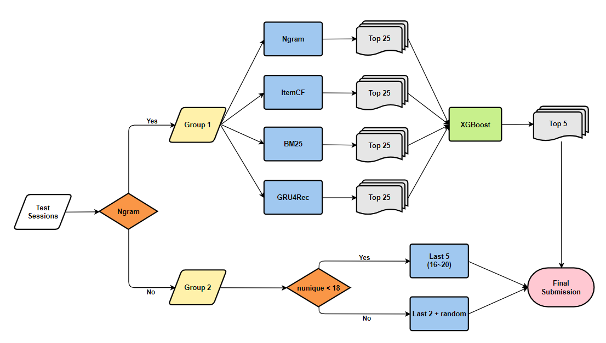

# KKCompany Music Challenge: Next-5 Songcraft  
https://www.kaggle.com/competitions/datagame-2023/overview  

## Our pipeline  
  

### step1  
Split the test sessions into 2 groups:  
- group1: Ngram method can predict all top5 results  
- group2: Ngram method can not predict all top5 results  

### step2  
For group1, we build a two-stage recommendation system.  
- stage1: we use 4 methods to retrieve 25 songs respectively  
    1. Ngram  
    2. ItemCF  
    3. BM25  
    4. GRU4Rec  
- stage2: we choose xgboost model as the rerank and retrieve 5 songs  

For group2, we simply use lastN songs and random new songs as our top5 recommendation.  
- last5 songs (listening_order = [16, 17, 18, 19, 20])  
    use on sessions where the number of unique songs is less than 18 among 20 songs in the session  
- last2 songs + random new songs  
    use on sessions where the number of ubique songs is greater or equal to 18 among 20 songs in the session  

### step3
We concat the results from 2 groups as our final submission (public score=0.55066)  
